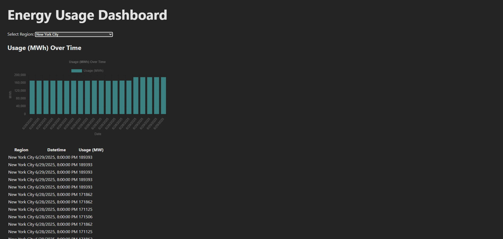

# EIA Electricity Demand Pipeline & Dashboard ⚡



This project provides an end-to-end pipeline to ingest, transform, and visualize electricity demand data from the U.S. Energy Information Administration (EIA). It includes:

- ✅ Python-based ETL pipeline
- ✅ Snowflake warehouse integration
- ✅ React + TypeScript dashboard
- ✅ Dockerized deployment

---

## 🚀 Quick Start with Docker

You can run the entire pipeline, backend API, and frontend dashboard using Docker:

```bash
docker-compose up --build
```

## Make sure you set up your env to connect to your Snowflake DB!
```bash
EIA_API_KEY=your_eia_key
SNOWFLAKE_USER=your_user
SNOWFLAKE_PASSWORD=your_password
SNOWFLAKE_ACCOUNT=your_account.region
SNOWFLAKE_WAREHOUSE=your_warehouse
SNOWFLAKE_DATABASE=your_database
SNOWFLAKE_SCHEMA=your_schema
SNOWFLAKE_ROLE=your_role
```
Then visit the live dashboard at:
👉 http://localhost:3000

EIA API --> Extraction Script --> Cleaned CSV --> Snowflake DB --> FastAPI --> React Dashboard

# Step 1: Data Ingestion

This pipeline begins by pulling **hourly electricity demand data** from the [U.S. Energy Information Administration (EIA)](https://www.eia.gov/opendata/) using their open API.

## Source

We use the endpoint:

```
https://api.eia.gov/v2/electricity/rto/daily-region-sub-ba-data/data/
```

This endpoint provides **regional electricity demand** across the U.S., organized by **RTO/ISO (region)** and **balancing sub-region (subba)**.

---

## How It Works

1. **Authentication**
   Your EIA API key is stored securely in a `.env` file and loaded via Python.

2. **Dynamic Parameters**
   The ingestion service constructs API requests with options like:

   * Frequency (`daily`)
   * Data type (`value`)
   * Sorting (`descending by period`)
   * Pagination (`offset`, `length`)

3. **Request & Save**

   * The script sends a request to EIA's API
   * Parses the JSON payload
   * Saves it to `data/` directory with a timestamped filename

---

## Project Structure

```
eiaGovPipeline/
├── extraction_service/
│   ├── config.py                  # Ingestion config
│   └── eia_ingestion_service.py  # Ingestion script
├── data/                         # Where raw JSON gets saved
├── .env                          # Stores your EIA_API_KEY (not committed)
```

---

## Setup Instructions

1. **Install dependencies**:

```
pip install requests python-dotenv
```

2. **Create `.env` file**:

```
EIA_API_KEY=your_real_key_here
```

3. **Run the ingestion service**:

```
python extraction_service/eia_ingestion_service.py
```

---

## Example Output

```
✅ Data saved to data/20250701_133219_eia_hourly_data.json
```

---

# Step 2: Data Transformation

Once the raw JSON data is saved, we process it into a clean format for analytics or loading into a database.

## Goal

Transform hourly electricity demand readings into a structured table that maps:

- **Datetime**
- **Region code** (e.g., `ERCO`, `NYIS`)
- **Subregion** (if applicable)
- **Electricity demand value**

---

## How It Works

1. **Load JSON File**
   * The transform script reads the latest file in the `data/` directory

2. **Normalize Structure**
   * Uses `pandas.json_normalize` to flatten nested JSON
   * Extracts only the relevant columns: `period`, `region`, `subregion`, `value`

3. **Clean Data**
   * Converts timestamp strings to proper datetime format
   * Fills missing subregions with 'N/A'
   * Filters out rows with missing or null demand values

4. **Export to CSV**
   * Cleaned data is saved to `data/` with a new timestamped name

---

## File Structure

```
eiaGovPipeline/
├── transform_service/
│   ├── config_transform.py     # Paths for transform step
│   └── clean_data.py           # Main transformation logic
```

---

## Example Output

```
✅ Cleaned data saved to data/20250701_135037_transformed.csv
```

---

# Step 3: Load to Snowflake

The final step in the pipeline uploads the transformed electricity demand data into **Snowflake**, split into two normalized tables:

- `REGIONS_DIM`: stores region/subregion metadata
- `POWER_USAGE_FACT`: stores time-series demand values

---

## How It Works

1. **Environment Setup**

   The script reads Snowflake credentials from a `.env` file using `python-dotenv`. Required keys:

   ```
   SNOWFLAKE_USER=
   SNOWFLAKE_PASSWORD=
   SNOWFLAKE_ACCOUNT=
   SNOWFLAKE_WAREHOUSE=
   SNOWFLAKE_DATABASE=
   SNOWFLAKE_SCHEMA=
   ```

2. **Data Preparation**

   * Automatically locates the latest transformed CSV in `transformed_data/`
   * Renames columns for Snowflake compatibility
   * Splits data into:
     - `regions_dim` (dimension table)
     - `power_usage_fact` (fact table with `usage_id`)

3. **Normalization**

   * Resets index and uppercases all column names to match Snowflake naming conventions
   * Ensures `write_pandas()` can process the DataFrame

4. **Snowflake Upload**

   * Establishes connection via `snowflake.connector`
   * Uploads each table using `write_pandas()`
   * Tables are overwritten each run (`overwrite=True`)
   * (Optional) Table creation SQL is available in the script as commented-out code

---

## Dependencies

```bash
pip install pandas snowflake-connector-python "pyarrow<19.0.0" python-dotenv
```

> ⚠️ Make sure `pyarrow` is below version 19 to avoid compatibility issues with Snowflake’s pandas integration.

---

## File Structure

```
eiaGovPipeline/
├── snowflake_load_service/
│   └── snowflake_load.py       # Handles data upload to Snowflake
├── transformed_data/           # Contains cleaned CSVs ready for loading
```

---

## Example Output

```
📂 Loading file: transformed_data/20250701_135037_transformed.csv
✅ REGIONS_DIM uploaded: True 415 rows
✅ POWER_USAGE_FACT uploaded: True 5000 rows
```

---

# Step 4: Frontend Dashboard (React + TypeScript)

This step introduces a fully interactive frontend dashboard to explore regional electricity usage data queried from Snowflake.

---

## Features

- ✅ Region filter via dropdown (`/api/regions`)
- ✅ Fetches demand data via FastAPI (`/api/data?region=...`)
- ✅ Usage (MWh) bar chart for the most recent 20 records
- ✅ Responsive data table (powered by TanStack Table)
- ✅ Fully typed frontend using React + TypeScript

---

## Tech Stack

- [React](https://reactjs.org/) + [TypeScript](https://www.typescriptlang.org/)
- [Chart.js](https://www.chartjs.org/) via [`react-chartjs-2`](https://react-chartjs-2.js.org/)
- [TanStack Table](https://tanstack.com/table) for tabular view
- [FastAPI](https://fastapi.tiangolo.com/) as API backend
- [Vite](https://vitejs.dev/) for frontend bundling

---

## File Structure

```bash
eiaGovPipeline/
├── frontend/
│   ├── src/
│   │   ├── App.tsx
│   │   ├── components/
│   │   │   ├── UsageChart.tsx
│   │   │   └── DataTable.tsx
│   │   └── main.tsx
│   ├── index.html
│   ├── package.json
│   ├── tsconfig.app.json
│   └── .env  # Optional: REACT_APP_API_URL=http://localhost:8000
```

## Setup Instructions

Install frontend dependencies
```bash
cd frontend
npm install
```
(Optional) Configure .env

```bash
REACT_APP_API_URL=http://localhost:8000
Run the frontend locally
```
```bash
npm run dev
Then open: http://localhost:5173
```
